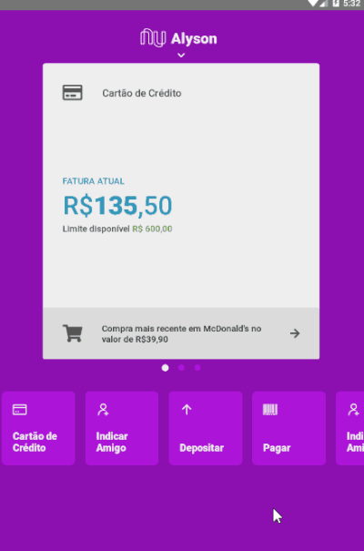
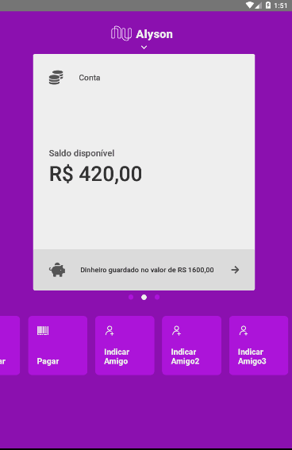
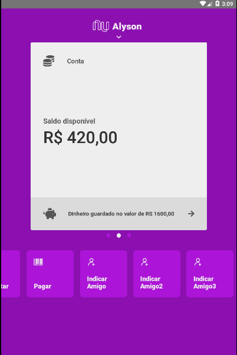

## Objective
This project was implemented in order to apply and practice `React-Native` concepts.

Although the project idea was inspired by a video from *Rocketseat*, the entire implementation was done independently.

## Examples

Custom animation | Menu screens | Fetching transactions |
---|---|---|
  |  | 

## Description
The project implements an prototype of Nubank in `React-Native`, using the following concepts:
- Componentization
- Drag/Slide down custom animations
- HTTP requests to fetch user's transactions data
- Data storage and persistence
- Automated tests for components and pages

## Examples

## Main Technologies and Tools
Besides `React-Native`, this project uses the following technologies in its implementation:
- **Redux** & **Redux-Persist**: used to store and persist data
- **Redux-Thunk**: applies middlewares in some action creators in order to deal with asynchronous code

## Tests
Automated tests for components were implemented using **Jest** and **Enzyme**
